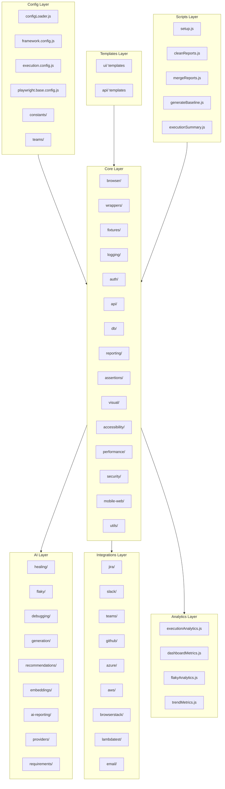
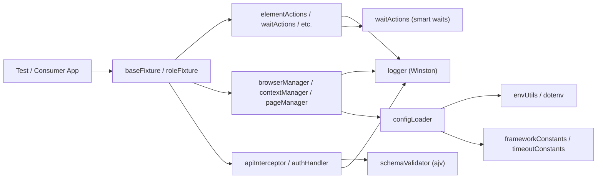

# 60-Day Playwright Enterprise Framework Learning Plan

## Current State of the Codebase

The framework has a well-defined folder structure with **157 files** across **10 major directories**. Most files are currently **stubs/skeletons** (containing only `// #genai` comments or placeholder code). Only a handful of files have real implementation so far:

- `core/logging/logger.js` -- Winston logger (fully implemented)
- `core/wrappers/elementActions.js` -- click, fill, getText (implemented)
- `core/wrappers/waitActions.js` -- waitForVisible, waitForHidden (implemented)
- `core/browser/browserManager.js` -- partial (constructor + launchBrowser stub)
- `config/constants/frameworkConstants.js` -- timeout constants
- `playwright.config.js` -- base Playwright configuration
- `.github/workflows/playwright.yml` -- GitHub Actions CI

Everything else is scaffolded but **not yet implemented** -- which is perfect for building and learning step by step.

---

## Framework Architecture Overview

---

## Calling Hierarchy (Design Pattern)

---

## Weekly Progress Tracker

- [ ] Week 1 (Days 1-7): Playwright fundamentals, Node.js modules, project skeleton, config architecture
- [ ] Week 2 (Days 8-14): Deep-dive into logger, waitActions, elementActions -- the only fully implemented modules
- [ ] Week 3 (Days 15-21): Browser lifecycle -- browserManager, contextManager, pageManager, storageManager, mobile-web
- [ ] Week 4 (Days 22-28): Fixtures (baseFixture, roleFixture, dbFixture) + Auth (login, token, session, SSO, OAuth)
- [ ] Week 5 (Days 29-35): API layer (interceptor, authHandler, schemaValidator) + DB clients + utility modules
- [ ] Week 6 (Days 36-42): Assertions, reporting pipeline, visual regression, performance, accessibility, security
- [ ] Week 7 (Days 43-49): Templates (POM), CI/CD (GitHub Actions), scripts, and all integrations (Jira, Slack, cloud)
- [ ] Week 8 (Days 50-56): AI layer (healing, flaky detection, debugging, generation, recommendations) + analytics
- [ ] Week 9 (Days 57-60): End-to-end trace, design pattern mapping, consumption model, write your own architecture doc

---

## Week 1 (Days 1-7): Foundation -- Playwright + Node.js + Project Setup

**Goal:** Understand Playwright fundamentals, Node.js module system, and the project skeleton.

| Day | Module | What to Learn |
|-----|--------|---------------|
| **1** | Playwright Basics | Install Playwright, understand `npx playwright test`, `test()`, `expect()`, `page` object. Read [playwright.config.js](playwright.config.js) line by line -- `defineConfig`, `testDir`, `timeout`, `fullyParallel`, `retries`, `workers`, `reporter`, `use` options. |
| **2** | Node.js Module System | `import` vs `require`, ES Modules (`"type": "module"` in [package.json](package.json)), `export default`, `module.exports`. Understand why the framework mixes both (legacy). Read [package.json](package.json) -- every dependency: `@playwright/test`, `winston`, `dotenv`, `ajv`, `faker`, `fs-extra`, `allure-playwright`, `plop`. |
| **3** | Folder Structure | Walk through every folder: `core/`, `config/`, `ai/`, `integrations/`, `analytics/`, `templates/`, `scripts/`. Understand the separation: **core = generic engine**, **templates = examples for consumers**, **ai = optional intelligence**. Read [learning.md](learning.md) again -- internalize the RICE framework and philosophy. |
| **4** | Design Patterns Overview | Study Singleton pattern (logger, wrappers), Factory pattern (browserManager, providerFactory), Strategy pattern (DB clients), Facade pattern (wrappers hiding Playwright complexity), Builder pattern (configLoader). Map each pattern to a file in the codebase. |
| **5** | OOP in JavaScript | Classes, constructors, `this` keyword, `async/await`, `static` methods, encapsulation. Study how [core/wrappers/elementActions.js](core/wrappers/elementActions.js) uses class + singleton export (`module.exports = new ElementActions()`). |
| **6** | Config Architecture | Read [config/global/configLoader.js](config/global/configLoader.js), [framework.config.js](config/global/framework.config.js), [execution.config.js](config/global/execution.config.js), [playwright.base.config.js](config/global/playwright.base.config.js). Understand layered config: global defaults -> team overrides -> env variables. Read [config/constants/frameworkConstants.js](config/constants/frameworkConstants.js). |
| **7** | Team Config + Constants | Read [config/teams/teamA.config.js](config/teams/teamA.config.js), teamB, teamC. Read [config/constants/timeoutConstants.js](config/constants/timeoutConstants.js), [apiConstants.js](config/constants/apiConstants.js). Understand how multiple teams share one framework with different configs. |

---

## Week 2 (Days 8-14): Core -- Logging + Wrappers (Fully Implemented)

**Goal:** Deep-dive into the only fully implemented modules. Understand every line.

| Day | Module | What to Learn |
|-----|--------|---------------|
| **8** | Winston Logger | Read [core/logging/logger.js](core/logging/logger.js) line by line. Understand `winston.createLogger`, `level`, `format.combine`, `format.timestamp`, `format.printf`, `transports` (Console + File). Why structured logging matters in enterprise. |
| **9** | Log Formatter + Execution Logger | Understand the stubs in [core/logging/logFormatter.js](core/logging/logFormatter.js) and [executionLogger.js](core/logging/executionLogger.js). Design what they should do: custom formats (JSON, plain text), per-test execution logs, log rotation, log levels per module. |
| **10** | WaitActions Wrapper | Read [core/wrappers/waitActions.js](core/wrappers/waitActions.js) line by line. Understand `locator.waitFor()`, `state: "visible"/"hidden"`, timeout parameter, why smart waits replace `page.waitForTimeout()`. Singleton export pattern. |
| **11** | ElementActions Wrapper | Read [core/wrappers/elementActions.js](core/wrappers/elementActions.js) line by line. How it depends on `waitActions`, the auto-wait-before-act pattern, `click()`, `fill()`, `getText()`. Why wrappers add logging + waits on top of raw Playwright. |
| **12** | Calling Hierarchy Deep-Dive | Trace the call chain: Test -> fixture -> elementActions.click() -> waitActions.waitForVisible() -> locator.waitFor() -> locator.click(). Draw this on paper. Understand why each layer exists. |
| **13** | Remaining Wrapper Stubs | Study stubs: [keyboardActions.js](core/wrappers/keyboardActions.js), [mouseActions.js](core/wrappers/mouseActions.js), [dragDropActions.js](core/wrappers/dragDropActions.js), [uploadActions.js](core/wrappers/uploadActions.js), [frameActions.js](core/wrappers/frameActions.js). Design what methods each should expose. |
| **14** | Wrapper Design Pattern | Understand the Facade pattern all wrappers implement: hide Playwright complexity, add logging, add smart waits, add retry hooks. Every wrapper follows the same template. Review the consistent pattern across all wrapper files. |

---

## Week 3 (Days 15-21): Core -- Browser Management

**Goal:** Understand browser lifecycle management.

| Day | Module | What to Learn |
|-----|--------|---------------|
| **15** | BrowserManager | Read [core/browser/browserManager.js](core/browser/browserManager.js). Understand `chromium`, `firefox`, `webkit` imports, `launchBrowser()`, headless mode. Study the bug (`flase` typo). Design: connect to remote browsers, browser pool. |
| **16** | ContextManager | Study [core/browser/contextManager.js](core/browser/contextManager.js). Learn Playwright BrowserContext: isolation, cookies, permissions, `storageState`, `newContext()`. Design: context factory, permission presets, viewport config. |
| **17** | PageManager | Study [core/browser/pageManager.js](core/browser/pageManager.js). Learn Page lifecycle: `newPage()`, default timeouts, `page.goto()`, `page.close()`. Design: multi-tab management, page pool, tab switching helpers. |
| **18** | StorageManager | Study [core/browser/storageManager.js](core/browser/storageManager.js). Learn `localStorage`, `sessionStorage` in Playwright via `page.evaluate()`. Design: save/restore storage state, session reuse across tests. |
| **19** | Browser Lifecycle Flow | Draw complete flow: `launchBrowser()` -> `createContext()` -> `createPage()` -> test runs -> `close()`. Understand how fixtures wire this together. |
| **20** | Mobile Web Support | Study [core/mobile-web/deviceManager.js](core/mobile-web/deviceManager.js), [viewportManager.js](core/mobile-web/viewportManager.js), [mobileActions.js](core/mobile-web/mobileActions.js). Understand Playwright `devices[]` registry, viewport emulation, touch events. |
| **21** | Review + Consolidation | Re-read all browser + wrapper modules. Draw the complete architecture diagram by hand. Write notes on how every module connects. |

---

## Week 4 (Days 22-28): Core -- Fixtures + Auth

**Goal:** Understand dependency injection and authentication patterns.

| Day | Module | What to Learn |
|-----|--------|---------------|
| **22** | Playwright Fixtures Concept | Study Playwright `test.extend()` API. How fixtures provide `page`, `context`, `browser` to tests. Why fixtures replace `beforeEach`/`afterEach` for setup/teardown. |
| **23** | BaseFixture | Read [core/fixtures/baseFixture.js](core/fixtures/baseFixture.js). Design: how it should provide `page`, `logger`, `config`, and later `apiClient`, `dbClient`, `aiClient`. This is the central dependency injection point. |
| **24** | RoleFixture | Study [core/fixtures/roleFixture.js](core/fixtures/roleFixture.js). Design: role-based presets (admin, user, viewer), compose with auth, pre-authenticated contexts per role. |
| **25** | LoginManager + TokenManager | Study [core/auth/loginManager.js](core/auth/loginManager.js) and [tokenManager.js](core/auth/tokenManager.js). Design: login via UI, store `storageState`, reuse across tests, token refresh logic. |
| **26** | SessionManager + SSO + OAuth | Study [core/auth/sessionManager.js](core/auth/sessionManager.js), [ssoManager.js](core/auth/ssoManager.js), [oauthManager.js](core/auth/oauthManager.js). Understand SSO flows, OAuth2 token exchange, session persistence. |
| **27** | Auth + Fixture Integration | Design the full auth flow: roleFixture selects role -> loginManager authenticates -> tokenManager stores tokens -> storageManager persists session -> contextManager creates pre-authenticated context. |
| **28** | DbFixture | Study [core/fixtures/dbFixture.js](core/fixtures/dbFixture.js). Design: `test.extend()` with DB client, seed test data before test, teardown after. How it pairs with `core/db/` clients. |

---

## Week 5 (Days 29-35): Core -- API + DB + Utilities

**Goal:** Understand API testing layer, database clients, and utility modules.

| Day | Module | What to Learn |
|-----|--------|---------------|
| **29** | API Interceptor | Study [core/api/apiInterceptor.js](core/api/apiInterceptor.js). Learn Playwright `APIRequestContext`, `page.route()` for network interception, request/response logging. Design: route recording, stubbing, mock responses. |
| **30** | Auth Handler (API) | Study [core/api/authHandler.js](core/api/authHandler.js). Design: auto-attach Bearer tokens, refresh on 401, cookie-based auth for API calls. How it integrates with `tokenManager`. |
| **31** | Schema Validator | Study [core/api/schemaValidator.js](core/api/schemaValidator.js). Learn `ajv` library for JSON Schema validation. Read the sample schema in [templates/api/sample.schema.js](templates/api/sample.schema.js). Design: validate API responses against schemas automatically. |
| **32** | DB Clients | Study all 4 clients: [postgresClient.js](core/db/postgresClient.js), [mysqlClient.js](core/db/mysqlClient.js), [mongoClient.js](core/db/mongoClient.js), [redisClient.js](core/db/redisClient.js). Understand the Strategy pattern: same interface, different implementations. |
| **33** | Query Executor | Study [core/db/queryExecutor.js](core/db/queryExecutor.js). Design: abstraction layer that takes a DB client + query string, executes, logs, returns results. Pairs with `dbAssertions`. |
| **34** | Utility Modules (Part 1) | Study [core/utils/envUtils.js](core/utils/envUtils.js), [fileUtils.js](core/utils/fileUtils.js), [jsonUtils.js](core/utils/jsonUtils.js). Design: dotenv loading, file I/O with `fs-extra`, JSON parse/stringify helpers. |
| **35** | Utility Modules (Part 2) | Study [core/utils/retryUtils.js](core/utils/retryUtils.js), [stringUtils.js](core/utils/stringUtils.js), [dateUtils.js](core/utils/dateUtils.js), [randomUtils.js](core/utils/randomUtils.js), [screenshotUtils.js](core/utils/screenshotUtils.js), [locatorUtils.js](core/utils/locatorUtils.js). Design: poll-backoff retry, named screenshots, role-based locator builders. |

---

## Week 6 (Days 36-42): Core -- Assertions + Reporting + Visual + Performance + Security

**Goal:** Understand specialized testing capabilities.

| Day | Module | What to Learn |
|-----|--------|---------------|
| **36** | Visual Assertions | Study [core/assertions/visualAssertions.js](core/assertions/visualAssertions.js). Learn `expect(page).toHaveScreenshot()`, mask regions, threshold configuration. |
| **37** | DB Assertions | Study [core/assertions/dbAssertions.js](core/assertions/dbAssertions.js). Design: assert query result counts, values, schemas. Soft assertion support. |
| **38** | Visual Regression Suite | Study [core/visual/visualComparator.js](core/visual/visualComparator.js), [imageDiff.js](core/visual/imageDiff.js), [baselineManager.js](core/visual/baselineManager.js). Understand pixelmatch, baseline image management, diff generation. |
| **39** | Reporting Pipeline | Study all 5 files in [core/reporting/](core/reporting/): `htmlReporter`, `allureManager`, `customReporter`, `artifactManager`, `reportAggregator`. Design: how reports are generated, screenshots/videos attached, multi-format output. |
| **40** | Performance Monitoring | Study [core/performance/pageMetrics.js](core/performance/pageMetrics.js), [lighthouseRunner.js](core/performance/lighthouseRunner.js), [apiPerformance.js](core/performance/apiPerformance.js), [networkMonitor.js](core/performance/networkMonitor.js). Understand Core Web Vitals, HAR recording, Lighthouse integration. |
| **41** | Accessibility Testing | Study [core/accessibility/accessibilityScanner.js](core/accessibility/accessibilityScanner.js), [axeRunner.js](core/accessibility/axeRunner.js), [wcagValidator.js](core/accessibility/wcagValidator.js). Understand axe-core integration, WCAG 2.1 compliance levels, a11y reporting. |
| **42** | Security Checks | Study [core/security/authSecurityChecks.js](core/security/authSecurityChecks.js), [headerValidator.js](core/security/headerValidator.js), [cookieValidator.js](core/security/cookieValidator.js). Design: validate security headers (CSP, HSTS), cookie flags (HttpOnly, Secure, SameSite). |

---

## Week 7 (Days 43-49): Templates + CI/CD + Scripts + Integrations

**Goal:** Understand how consumers use the framework and how it fits into CI/CD.

| Day | Module | What to Learn |
|-----|--------|---------------|
| **43** | UI Templates | Read all 4 template files: [sample.spec.js](templates/ui/sample.spec.js), [sample.page.js](templates/ui/sample.page.js), [sample.locators.js](templates/ui/sample.locators.js), [sample.data.js](templates/ui/sample.data.js). Understand the Page Object Model pattern: locators separate from page objects, page objects separate from tests, test data separate from everything. |
| **44** | API Templates | Read [sample.api.spec.js](templates/api/sample.api.spec.js), [sample.service.js](templates/api/sample.service.js), [sample.payload.js](templates/api/sample.payload.js), [sample.schema.js](templates/api/sample.schema.js). Understand the Service Object pattern for API testing. |
| **45** | GitHub Actions CI | Read [.github/workflows/playwright.yml](.github/workflows/playwright.yml) line by line. Understand: checkout, Node setup, `npm ci`, `playwright install --with-deps`, `npx playwright test`, artifact upload. Design: matrix builds, sharding, Allure report generation. |
| **46** | Scripts | Study all 5 scripts: [setup.js](scripts/setup.js), [cleanReports.js](scripts/cleanReports.js), [mergeReports.js](scripts/mergeReports.js), [generateBaseline.js](scripts/generateBaseline.js), [executionSummary.js](scripts/executionSummary.js). Design: first-run setup, report cleanup, shard merging, visual baseline generation, execution summary output. |
| **47** | Jira + Slack Integrations | Study [integrations/jira/jiraClient.js](integrations/jira/jiraClient.js) and [integrations/slack/slackFormatter.js](integrations/slack/slackFormatter.js). Design: auto-create Jira bugs on failure, Slack notifications with test summary. |
| **48** | Cloud Provider Integrations | Study [integrations/browserstack/browserstackManager.js](integrations/browserstack/browserstackManager.js), [integrations/lambdatest/lambdatestManager.js](integrations/lambdatest/lambdatestManager.js). Design: connect to cloud browser grids, capability management. |
| **49** | Remaining Integrations | Study [integrations/github/githubActionsReporter.js](integrations/github/githubActionsReporter.js), [integrations/azure/azurePipelineReporter.js](integrations/azure/azurePipelineReporter.js), [integrations/aws/s3Uploader.js](integrations/aws/s3Uploader.js), [integrations/aws/secretManager.js](integrations/aws/secretManager.js), [integrations/teams/teamsNotifier.js](integrations/teams/teamsNotifier.js), [integrations/email/mailReporter.js](integrations/email/mailReporter.js). |

---

## Week 8 (Days 50-56): AI Layer + Analytics

**Goal:** Understand AI-assisted testing concepts and analytics dashboards.

| Day | Module | What to Learn |
|-----|--------|---------------|
| **50** | AI Config + Providers | Study [ai/config/aiConfig.js](ai/config/aiConfig.js), [ai/config/modelConfig.js](ai/config/modelConfig.js), [ai/config/providerConfig.js](ai/config/providerConfig.js), [ai/providers/claudeProvider.js](ai/providers/claudeProvider.js), [ai/providers/providerFactory.js](ai/providers/providerFactory.js). Understand the Provider + Factory pattern for pluggable AI backends. |
| **51** | Self-Healing Locators | Study [ai/healing/locatorHealer.js](ai/healing/locatorHealer.js), [selectorAnalyzer.js](ai/healing/selectorAnalyzer.js), [fallbackLocator.js](ai/healing/fallbackLocator.js), [healingReportGenerator.js](ai/healing/healingReportGenerator.js). Understand the concept: when a locator breaks, AI suggests alternatives. Read [ai/prompts/locatorHealingPrompt.txt](ai/prompts/locatorHealingPrompt.txt). |
| **52** | Flaky Test Detection | Study [ai/flaky/flakyDetector.js](ai/flaky/flakyDetector.js), [stabilityAnalyzer.js](ai/flaky/stabilityAnalyzer.js), [retryInsights.js](ai/flaky/retryInsights.js), [flakyDashboard.js](ai/flaky/flakyDashboard.js). Understand: how to detect flaky tests by tracking pass/fail patterns across runs. |
| **53** | AI Debugging | Study [ai/debugging/failureAnalyzer.js](ai/debugging/failureAnalyzer.js), [stacktraceAnalyzer.js](ai/debugging/stacktraceAnalyzer.js), [screenshotAnalyzer.js](ai/debugging/screenshotAnalyzer.js), [consoleLogAnalyzer.js](ai/debugging/consoleLogAnalyzer.js), [networkAnalyzer.js](ai/debugging/networkAnalyzer.js), [videoAnalyzer.js](ai/debugging/videoAnalyzer.js). Read [ai/prompts/failureAnalysisPrompt.txt](ai/prompts/failureAnalysisPrompt.txt). |
| **54** | AI Generation + Requirements | Study [ai/generation/testGenerator.js](ai/generation/testGenerator.js), [apiTestGenerator.js](ai/generation/apiTestGenerator.js), [locatorGenerator.js](ai/generation/locatorGenerator.js), [pageObjectGenerator.js](ai/generation/pageObjectGenerator.js), [mockDataGenerator.js](ai/generation/mockDataGenerator.js). Study [ai/requirements/scenarioGenerator.js](ai/requirements/scenarioGenerator.js), [storyAnalyzer.js](ai/requirements/storyAnalyzer.js). |
| **55** | AI Recommendations + Knowledge Base | Study [ai/recommendations/](ai/recommendations/) (waitRecommendations, selectorRecommendations, assertionRecommendations, frameworkOptimization). Study [ai/embeddings/](ai/embeddings/) (vectorStore, frameworkKnowledgeBase, executionHistoryStore). Understand long-term organizational learning. |
| **56** | Analytics Dashboard | Study all 4 analytics files: [analytics/executionAnalytics.js](analytics/executionAnalytics.js), [dashboardMetrics.js](analytics/dashboardMetrics.js), [flakyAnalytics.js](analytics/flakyAnalytics.js), [trendMetrics.js](analytics/trendMetrics.js). Design: pass/fail trends, module stability scores, release quality prediction. |

---

## Week 9 (Days 57-60): Architecture Review + End-to-End Understanding

**Goal:** Consolidate everything into a complete mental model.

| Day | Module | What to Learn |
|-----|--------|---------------|
| **57** | End-to-End Data Flow | Trace a complete test execution from `npx playwright test` through: config loading -> fixture setup -> browser launch -> context creation -> page creation -> wrapper actions -> assertions -> reporting -> teardown -> artifact collection. Draw the full sequence diagram. |
| **58** | Design Pattern Mapping | Map every design pattern to its file: Singleton (logger, wrappers), Factory (browserManager, providerFactory), Strategy (DB clients), Facade (wrappers), Builder (configLoader), Observer (customReporter), Template Method (baseFixture), Dependency Injection (fixtures). |
| **59** | Enterprise Consumption Model | Understand how a consumer application repo uses this framework: install as dependency -> import fixtures -> extend with app-specific page objects -> write tests -> run via CI. The framework is the **engine**, the app repo is the **car body**. Review templates as the bridge. |
| **60** | Architecture Document + Roadmap | Write your own architecture document covering: folder structure, calling hierarchy, design patterns, module responsibilities, integration points, AI capabilities. Map the 10-phase roadmap from learning.md to the codebase folders. Identify which phases are complete, in-progress, and pending. |

---

## Key Design Patterns in This Framework

| Pattern | Where Used | Purpose |
|---------|-----------|---------|
| **Singleton** | `logger.js`, `elementActions.js`, `waitActions.js` | Single instance shared across framework |
| **Factory** | `browserManager.js`, `providerFactory.js` | Create objects without specifying exact class |
| **Facade** | All wrappers (`elementActions`, `waitActions`, etc.) | Simplify complex Playwright API |
| **Strategy** | DB clients (`postgres`, `mysql`, `mongo`, `redis`) | Interchangeable algorithms |
| **Builder** | `configLoader.js` | Step-by-step config construction |
| **Template Method** | `baseFixture.js` | Define skeleton, let subclasses fill steps |
| **Observer** | `customReporter.js` | React to test lifecycle events |
| **Dependency Injection** | All fixtures | Provide dependencies to tests |

---

## Key Concepts to Track While Learning

1. **Separation of Concerns:** Framework (generic) vs Application (specific)
2. **No hardcoded waits:** Every action goes through `waitActions` first
3. **Everything is logged:** Every action calls `logger.info()` before and after
4. **Config-driven:** Behavior changes via config, not code changes
5. **Module system awareness:** `import/export` (ESM) vs `module.exports/require` (CJS) -- the codebase currently mixes both; this needs cleanup
6. **Fixture-first architecture:** Tests get dependencies via fixtures, not global imports
7. **AI assists, not controls:** AI modules provide suggestions, humans make decisions

---

## Daily Learning Format (Recommended)

For each day:
1. **Read** the target file(s) line by line (15 min)
2. **Understand** the design pattern and calling hierarchy (15 min)
3. **Implement or design** the stub/skeleton (20 min)
4. **Document** what you learned -- calling chain, pattern used, why it exists (10 min)
